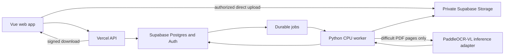

# StockShift architecture assessment and implementation proposal

Date: 5 October 2026. Status: proposal only; no application implementation or infrastructure provisioning.

## 1. Evidence and scope

Read `AGENTS.md` first, then inspected every tracked project file, the available file inventory, Git status and recent history. The repository contains exactly four tracked files: `.gitignore`, `AGENTS.md`, `README.md`, and `docs/PRODUCT_TARGET.md`. HEAD is `2288f4b` (`Add finished product target`); the working tree was clean before this assessment.

**The existing private CSV MVP source is not present.** README explicitly confirms that it has not been imported. There is no application manifest, source tree, lockfile, database migration, test suite, deployment configuration, or worker. The existing architecture is a documented target, not running software. There is no working implementation here to preserve or refactor.

AGENTS identifies the Notion sprint **StockShift — Finished Product Sprint** as the product source of truth. Its contents could not be verified: the session exposes Notion search, but not the access-discovery tool that its instructions require before searching, and the repository contains no sprint URL/ID. This proposal uses AGENTS and PRODUCT_TARGET as the local requirements, supported by the StockShift builder brief. Reconcile it against the sprint before implementing sprint-specific acceptance criteria. Do not represent the local documents as a verified copy of that sprint.

AGENTS suggests scaffolding if the MVP is missing. The user's explicit request for assessment only takes precedence: this change adds this document, not a production scaffold. The exact scaffold proposed for the next implementation commit is in section 10.

## 2. Current architecture and production gaps

| Area | Observed state | Required production component |
| --- | --- | --- |
| Web | No implementation | Vue 3, Vite, TypeScript, Tailwind; Upload → Match → Review → Export |
| API | None | Vercel functions for authenticated orchestration, pagination, review, export requests |
| Persistence | None | Supabase migrations, immutable input/result revisions, tenant RLS |
| Identity/files | None | Supabase Auth, membership roles, private Storage, controlled uploads/downloads |
| Structured imports | None | Direct CSV/XLSX parsing, mappings, explicit numeric conventions, validation |
| Reconciliation | None | Unique exact matching, decimal calculations, duplicates/conflicts, review states |
| Document extraction | None | Digital-PDF path, provider abstraction, PaddleOCR-VL adapter, evidence |
| Async work | None | Durable jobs, leases, retries, checkpointing, dispatch recovery, cancellation |
| Commercial output | None | Gross-margin impact, threshold settings, versioned customer export profiles |
| Billing | None | Stripe subscription/payment state, deduplicated webhooks, usage accounting |
| Operations | None | CI, realistic fixtures, auditability, monitoring, backup/restore, retention |

## 3. Recommended architecture

Use a small monorepo with one web/API deployment and one Python application, with an optional isolated GPU inference deployment when OCR is introduced. Avoid a collection of independent business microservices.



**Vue:** upload/mapping forms, actual processing stages, paginated results, source comparison panel, review decisions, export settings. Display decimal strings using an explicit formatting policy; do not convert prices to JavaScript `Number` for calculation. Keep navigation to Comparisons, Exports, Settings. Use the brief's forest-green palette and readable tables.

**Vercel API:** authenticate the caller, derive authorized tenant context, validate requests, finalize uploads, enqueue jobs atomically, provide paginated reads, apply review transactions, and authorize downloads. Return `202` plus a resource/job ID for long-running work. File bytes travel directly to Storage. Vercel functions have execution and payload limits; they should not host the OCR pipeline or large catalogue processing. [Vercel limits](https://vercel.com/docs/functions/limitations)

**Python:** owns direct parsing, document extraction, normalization, matching, decimal arithmetic, margin calculations, and CSV/XLSX generation. This avoids separately implementing the calculation engine in TypeScript and Python. Domain code has no database, web-framework, or Paddle imports. Infrastructure adapters handle persistence, storage, providers, and job execution.

**Supabase:** system of record for membership, input revisions, products, results, review history, durable job state, and export manifests. Storage holds originals, extraction artifacts, page evidence, and completed exports in private buckets.

**GPU inference:** introduced only after digital PDF support. Deploy separately so CSV/XLSX processing does not require a GPU image. Select an on-demand container/GPU host through a real sample benchmark; provider choice, region, cold-start time, retention terms, and cost are unresolved procurement decisions. The architecture does not depend on a particular vendor.

### Domain rules

- Preserve identifiers as strings, including leading zeros. Preserve raw and normalized identifiers separately. Match supplier SKUs within supplier context and manufacturer part numbers within manufacturer context.
- Auto-match unique, compatible exact identifiers. Conflicting identifiers, duplicates, normalization collisions, and likely matches enter review. Accepted matches must be one-to-one.
- Keep primary outcome (`unchanged`, `changed`, `new`, `absent`, `needs_review`) separate from independent flags such as price increase/decrease, description, pack, UOM, and code change. “Absent from supplied file” does not prove discontinuation.
- Money is decimal text across JSON, Python `Decimal` internally, and Postgres `numeric`. Never round at ingestion, and never substitute zero for blank or invalid prices. Numeric precision and display rounding are different concerns. [Postgres numeric types](https://www.postgresql.org/docs/current/datatype-numeric.html)
- Cost difference is `new_cost - old_cost`; percentage change is `(new_cost - old_cost) / old_cost * 100`. For old cost zero, percentage is undefined. Reject non-finite values and route negative/ambiguous values for review rather than classifying them normally.
- Compare price only when currency, pack/UOM and tax basis are compatible. Do not perform an implicit currency conversion or assume that pack prices are unit prices.
- Gross margin is `(net_selling_price - comparable_cost) / net_selling_price * 100`. Evaluate old and new cost against the same chosen selling-price scenario. Store the selling-price source, unit conversion, tax assumptions and threshold version. Report percentage-point margin change; missing/zero selling price produces “not calculable.” RRP is not automatically the customer's selling price. No aggregate revenue/profit impact without quantities.
- Review must cover extraction corrections and match decisions separately. Corrections create a new normalized input revision and invalidate dependent results; they never overwrite original evidence.

## 4. Proposed final folder structure

This is the intended final layout, not a request to create empty directories for every future feature in the first commit.

```text
stockshift/
  AGENTS.md
  README.md
  package.json                 # npm workspaces and common commands
  package-lock.json
  .env.example                 # variable names only
  .github/workflows/ci.yml
  apps/
    web/                       # Vercel project root
      package.json
      index.html
      vite.config.ts
      tsconfig.json
      vercel.json              # SPA fallback excludes /api routes
      src/
        app/                   # router, layout, providers
        features/
          auth/
          comparisons/
          uploads/             # file selection and import mapping
          review/              # evidence and confirm/reject/correct
          exports/
          settings/
        components/            # shared UI primitives
        lib/                   # API client, Supabase browser client, display
        styles/
      api/                     # thin Vercel endpoint handlers
        comparisons/
        files/
        reviews/
        exports/
        internal/              # protected dispatch/recovery endpoints
        billing/
      server/                  # auth, authorization, DB, service operations
      tests/
  packages/
    contracts/
      schemas/                 # canonical versioned JSON Schemas
      src/                     # generated TS types and runtime validation
      scripts/                 # generation/checking; no business arithmetic
  services/
    worker/
      pyproject.toml
      uv.lock
      Dockerfile               # CPU runtime
      src/stockshift_worker/
        contracts/             # Python validators for shared schemas
        domain/                # products, matching, changes, margin, review
        extraction/
          base.py              # DocumentExtractor protocol
          router.py
          csv_extractor.py
          xlsx_extractor.py
          digital_pdf_extractor.py
          paddleocr_vl_extractor.py
          evidence.py
        normalization/
        exports/
        jobs/                  # handlers, leases, heartbeats, checkpoints
        infrastructure/        # DB, Storage, inference, telemetry
        entrypoints/           # run-one-job CLI; local worker loop
      tests/                   # domain, adapters, jobs, golden documents
    ocr/                       # later isolated inference image/config
      Dockerfile
      README.md
  supabase/
    config.toml
    migrations/
    tests/                     # constraints, RLS, job/review transactions
    seed.sql                   # synthetic fixtures only
  tests/
    fixtures/                  # CSV/XLSX/PDF and golden expectations
    e2e/                       # browser flow and tenant-boundary cases
  docs/
    PRODUCT_TARGET.md
    ARCHITECTURE_ASSESSMENT.md
    adr/
    runbooks/
```

Configure Vercel with root `apps/web`; API dependencies reference the contracts workspace. Resolve/package workspace imports in a preview deployment before relying on them. Python consumes the same schema versions and JSON fixtures. Generated clients/models are convenience outputs, not a second manually maintained contract.

## 5. Proposed database schema

Use UUID primary keys, UTC `timestamptz`, explicit status checks, and immutable version references. Every tenant-owned table has `tenant_id NOT NULL`; each referenced parent exposes `UNIQUE (tenant_id, id)`, and child foreign keys include tenant_id. This prevents a valid row from linking to another tenant's resource even when an internal worker bypasses RLS.

The following is a concrete logical schema for subsequent migrations, not executable SQL applied during this assessment. JSONB contains versioned configuration or evidence, not the primary searchable product fields.

| Table | Main columns and relationships |
| --- | --- |
| `tenants` | `id`, `name`, `created_at` |
| `tenant_memberships` | `tenant_id`, `user_id → auth.users`, `role` (`owner`, `editor`, `viewer`); composite PK |
| `suppliers` | `id`, `tenant_id`, `name`; minimal identifier context, not supplier management |
| `source_files` | `id`, `tenant_id`, `uploaded_by`, `bucket`, `object_key`, original name, verified MIME, byte count, server SHA-256, upload state, retention/deletion dates |
| `import_profiles` | `id`, `tenant_id`, optional supplier, `version`, mapping JSONB, sheet/header selection, encoding, delimiter, explicit locale/currency/UOM/tax rules; immutable versions |
| `comparisons` | `id`, `tenant_id`, supplier, creator, title, current published `run_id`, `review_revision bigint`, lifecycle state, created/finished dates |
| `comparison_files` | `id`, `tenant_id`, comparison, source file, `side` (`current`, `incoming`), position; allows eventual multi-file catalogues |
| `extraction_runs` | `id`, `tenant_id`, source file, cache key, provider/SDK/model version, configuration hash, contract version, state, raw artifact key, completed/expected page counts, warnings |
| `catalogue_versions` | `id`, `tenant_id`, comparison-file link, extraction run, import-profile version, normalization version, correction revision, state and completeness metadata |
| `catalogue_products` | `id`, `tenant_id`, catalogue version, record ordinal, raw/normalized SKU, description, manufacturer, MPN, GTIN, pack quantity, UOM, cost, retail/RRP separately, currency, price basis, availability, validation status, raw-record artifact reference |
| `field_provenance` | `id`, `tenant_id`, product, field name, raw text, source file, page, sheet, source row, column, table/cell locator, bounding polygon, coordinate system, evidence key, provider score and score type |
| `record_corrections` | `id`, `tenant_id`, base catalogue/product, field name, corrected typed value, reason, actor, created date, resulting catalogue revision; append-only |
| `comparison_runs` | `id`, `tenant_id`, comparison, current/incoming catalogue versions, engine version, settings snapshot/hash, state, result revision, completion time |
| `match_candidates` | `id`, `tenant_id`, run, old/new products, method, evidence JSONB, heuristic score/type, proposal status; multiple candidates allowed |
| `comparison_results` | `id`, `tenant_id`, run, nullable old/new product, accepted candidate, primary outcome, changed-field flags, review state, cost delta/percentage, old/new margin, margin-point delta, calculation issues |
| `review_events` | `id`, `tenant_id`, comparison/run, result/candidate, action, actor, reason, previous/new state, expected/committed review revision, idempotency key; append-only |
| `jobs` | `id`, `tenant_id`, kind, target ID, idempotency key, state, available date, priority, attempt/max-attempt count, lease owner/token/expiry, heartbeat, current stage, real completed/total units, sanitized failure code, input version, result reference |
| `job_attempts` | `id`, `tenant_id`, job, attempt number, dispatch execution ID, lease token, started/finished dates, outcome, structured diagnostic artifact |
| `export_profiles` | `id`, `tenant_id`, name, version, format, ordered column mapping, constants/defaults, decimal/rounding policy, delimiter/encoding, target validation rules; immutable versions |
| `exports` | `id`, `tenant_id`, comparison/run, review revision, profile version, selection, immutable snapshot artifact/hash, state, output key, row count, creator and date |
| `billing_accounts` | tenant PK, Stripe customer/subscription identifiers, entitlement state and sync time; server-write only |
| `billing_events` | Stripe event ID PK, tenant if resolved, event type, processing state, received/processed dates; private schema |
| `usage_events` | `id`, `tenant_id`, job/comparison, usage type, units, unique usage key, created date; retries cannot charge twice |

### Types and constraints

- Money columns: unconstrained `numeric` with application bounds on magnitude and source precision, plus checks forbidding non-finite values. Avoid a default two-decimal scale that would silently round supplier unit costs. Preserve original lexical representation/scale in provenance; serialize typed values as decimal strings. Pack quantities and derived percentages also use decimal semantics, with an explicit versioned calculation precision/rounding policy.
- Use text identifiers; never numeric SKU/MPN/GTIN columns. Index raw exact identifiers and normalized lookup keys within catalogue/supplier scope. **Do not impose SKU uniqueness on imported rows:** duplicates are evidence requiring review.
- `UNIQUE (tenant_id, catalogue_version_id, record_ordinal)` prevents retry duplication. Permit several provenance entries for a field spanning cells/pages.
- Cache key uniqueness includes tenant, server-verified file hash, extractor/model/SDK/config/contract version. Normalization identity also includes mapping, locale, currency, normalization and correction versions. Extraction cache never mixes tenants.
- Each result has at least one old/new product. Partial unique indexes on `(tenant_id, run_id, old_product_id)` and on `(tenant_id, run_id, new_product_id)` enforce one-to-one published results. Candidate proposals do not reserve accepted slots. Validated old/new products must belong to the run's correct input versions; enforce this with constrained references or transactional constraint triggers, not RLS alone.
- Rejecting a proposal regenerates appropriate unmatched results atomically; confirming a proposal removes/replaces the affected unmatched results and recalculates flags/counts in the same transaction. Conflicting simultaneous confirmations return a conflict rather than reusing a product.
- A published run requires both inputs complete and validated enough for its declared result mode. Partial extraction may be viewed as a draft, but cannot imply a complete catalogue or produce normal absence classifications.
- Index tenant/date comparison lists; tenant/run/status/record cursors for results; product provenance; memberships `(user_id, tenant_id)`; due jobs `(state, available_at, priority)` and expired leases. Paginate result rows; avoid sending whole catalogues to the browser.

### Authorization and RLS

Use `auth.users` for identity; do not create a competing password/users table. Authorize from current database memberships, not user-editable JWT metadata. Viewer can read; editor can create comparisons/review/export; owner can change membership/billing/settings. Membership changes must not allow self-promotion.

Enable RLS and explicit minimum grants on all exposed tables. Browser clients read approved tenant-scoped views/data; review/job/result/entitlement writes use constrained API operations and transactions. UPDATE rules need both `USING` and `WITH CHECK`. Internal jobs/billing attempts belong in a non-exposed schema with no client grants. Worker privileges are separate from user privileges; tenant references and job tokens still need validation. Use narrowly granted invoker functions where possible; if privileged functions are necessary, fix search_path and revoke default public execution. Validate the membership policy design against recursive-policy problems.

Supabase documentation separates table grants from row policies; both are necessary. Its server service role bypasses RLS, so keep it server-side and do not treat tenant RLS as protection against careless privileged worker writes. [RLS documentation](https://supabase.com/docs/guides/database/postgres/row-level-security)

Private Storage paths use `tenant_id/file_id/...`; Storage policies check actual membership and the registered resource. API validates upload finalization against the authorized object, checks bytes/type/hash, and issues short-lived upload/download authorization. Never accept arbitrary fetch URLs from a job payload. Source objects are immutable after finalization. [Storage access control](https://supabase.com/docs/guides/storage/security/access-control)

Test two tenants and every role for read/write denial, cross-tenant foreign keys, membership escalation, storage paths, review conflicts, and privileged job writes. Source deletion/retention must include evidence, extraction caches, temporary artifacts and exports; refuse reuse of deleted inputs and preserve an appropriate audit tombstone.

## 6. Durable background processing

**Increment 5 implementation (October 5, 2026):** the local Vue app now supports
authenticated tenant context, supplier/comparison creation, private verified CSV
uploads, durable processing status, persisted result filtering and evidence inspection.
Append-only `review_events` record explicit rejection/no-match exclusions. No human
approval recalculates unsupported matches. Tenant-scoped RPCs compute counts from
persisted rows and block export until all reviews are resolved; the server serializes
only deterministic changed outcomes with decimal text and formula-safe text cells.
See `docs/LOCAL_CSV_WORKFLOW.md`. Expanded matching, exports and hosted deployment
described below remain future work.

**Increment 4 implementation (October 5, 2026):** the local CSV slice now uses
PostgreSQL jobs/attempts, immutable comparison input/settings snapshots, run-scoped
results and pending review candidates. Authenticated owner/editor enqueue is
tenant-constrained. Service-only worker RPCs claim with `SKIP LOCKED`, issue fenced
120-second leases, heartbeat every 30 seconds, and atomically publish outputs.
Expired leases recover on polling; transient failures use bounded exponential
retry, and exhausted attempts become inspectable dead letters. The Python CLI
supports local `--once`/`--poll`, verifies registered blob bytes/hash, executes the
existing CSV engine and persists exact values/provenance. Final verification uses
Docker-backed local Supabase. See `services/worker/README.md` for concrete commands,
limits and state transitions. The broader extraction/export/dispatcher/cancellation
architecture below remains a future design, outside this increment.

Start with a Postgres-backed `jobs` table rather than an additional broker. Use at-least-once execution with idempotent commits; do not promise exactly-once execution.

1. API finalizes a Storage upload after validation and creates the file/input reference and initial job in a transaction. Job kinds are `extract`, `normalize`, `reconcile`, `export`, and `cleanup`. Use CPU/GPU capability tags for dispatch.
2. After commit, attempt to wake the external container runner. A scheduled dispatcher also scans due jobs, so a failed wake request cannot lose committed work. The jobs table itself is the durable dispatch source; no separate outbox is needed unless another external event stream is introduced.
3. A worker claims a due job through a short atomic transaction using `FOR UPDATE SKIP LOCKED`, records an attempt, assigns a random lease token, and sets a lease expiry. Release the database lock before reading files or invoking providers. Postgres supports the needed row-locking primitives. [Explicit locking](https://www.postgresql.org/docs/current/explicit-locking.html)
4. Use an initial 120-second lease, heartbeat every 30 seconds, and a periodic expired-lease recovery scan as configurable defaults. Size these against actual host/provider timeouts. Every heartbeat, checkpoint and finish write compares the current lease token: a recovered job fences out its previous worker.
5. Stage writes go into attempt-specific staging rows/artifacts. Completion checks the lease, promotes a validated immutable result manifest, updates stage state and enqueues the next dependent stage in one transaction. A file exists in Storage only after upload, so create the object first, then commit its reference; clean orphan objects later. Never mark a job complete before durable output is available.
6. Retry transient storage/network/runner/provider failures with exponential backoff and jitter, initially at most five attempts. Invalid input/configuration is terminal or awaits user correction; repeated retries cannot fix it. Exhausted attempts stay inspectable with a safe message and manual retry action.
7. Cancellation records a request; workers check between chunks/pages. Finish transactions check cancellation as well as the lease so cancelled outputs cannot be published late. Keep per-stage execution deadlines distinct from lease expiry.

Extraction and normalization can run in parallel for the two inputs; reconciliation waits for both complete catalogue revisions. Large document jobs checkpoint page batches; cache validated page output, then assemble a whole-document manifest. A missing/failed page keeps the input incomplete. Parallel attempts must not overwrite each other's artifacts.

Initial production execution: container run-per-job for CPU work; protected Vercel dispatcher invokes the runner's launch API and returns promptly. Scheduled recovery relaunches only claimable jobs. Configure dispatch cadence to meet the expected wait time and verify schedule support on the selected plan. If the host offers no reliable scheduled wake/launch API, choose another host or explicitly operate a small CPU poller; scale-to-zero does not work without a wake mechanism. GPU inference must have the same recovery/cold-start budget and scale down when idle.

Job state machine: `queued → running → succeeded`, with `running → retry_wait → running`, `failed`, or `cancelled`. UI states include waiting for worker capacity, extracting pages, validating records, comparing, awaiting review, generating export. Show measured page/row progress only when the denominator is known; otherwise show a stage and elapsed time. Poll initially; Realtime is an optional UX optimization, never the source of durable state.

Exports are jobs. The request transaction checks the expected review revision and stores an immutable snapshot/profile/selection reference. Subsequent decisions do not alter an in-flight export. Downloads show the revision used and can indicate that a newer review exists. Import-ready exports include only approved, valid rows; unresolved rows appear solely in an explicitly labeled review export. Profile rules preserve internal versus supplier identifiers, column order, encoding and decimal precision. Treat spreadsheet formula-like text safely; output XLSX text cells as text and never calculate input workbook formulas.

## 7. Extraction boundary and PaddleOCR-VL integration

Define a versioned Python `DocumentExtractor` protocol:

```text
extract(request: ExtractionRequest, context: JobContext) -> ExtractionResult

ExtractionRequest:
  tenant/file/job IDs; authorized object reference; verified SHA-256
  page/sheet selection; mapping/config reference; contract version

ExtractionResult:
  provider/SDK/model/config versions; raw artifact reference
  extracted records/cells with optional semantic field candidates
  per-field evidence and raw tokens; warnings and quality reasons
  expected/completed pages or sheets; complete/incomplete state
```

The extractor reads documents and emits evidence, not matches, margins or approvals. Direct parsers emit cells/rows and mapped candidate fields; OCR adapters emit table/cell candidates through the same contract. Normalization separately validates and parses values with an explicit mapping/locale profile into `NormalizedProduct` records. That separation lets a user change column mapping without rerunning OCR.

Normalized products contain raw/source identifiers, optional typed identifiers, description/manufacturer, decimal-string cost/retail/RRP, currency, decimal pack quantity, UOM/price/tax basis, availability, validation issues, and evidence references. Prices are nullable when unknown. Scores have a `score_type`; extraction scores and matching scores remain distinct. A missing provider confidence stays missing. A layout-detection score is not a probability that a price is correct.

Routing:

1. Validate actual file content, size and expansion/page limits; do not trust extension alone.
2. CSV → direct streamed parser with encoding/delimiter/header settings. XLSX → direct workbook parser, explicit sheet selection, cached-formula policy, string identifier handling. Numeric Excel cells that already lost leading zeros must be flagged; do not invent the missing digits.
3. PDF → inspect page text/layout first. Extract text/tables with deterministic tooling where reliable; flag broken columns, unreadable tokens or incomplete tables.
4. Route scanned/difficult pages to `PaddleOcrVlExtractor`. Mixed PDFs can use both methods by page; reconcile reading order and repeated headers and preserve page completeness.
5. Validate candidates for missing required fields, ambiguous decimals, malformed identifiers, table continuity and suspicious OCR substitutions. Keep them reviewable; do not silently “repair” commercial values.

**Exact integration point:** `services/worker/src/stockshift_worker/extraction/paddleocr_vl_extractor.py`, selected by `router.py`, implementing `base.py`'s protocol. A provider client behind this adapter calls either a locally initialized `PaddleOCRVL` pipeline in an OCR image or its authenticated inference service. The current official tutorial documents Python `PaddleOCRVL` integration and service deployment. Use structured JSON results as adapter input and retain raw outputs/evidence. It does not supply StockShift's validated product schema automatically. [PaddleOCR-VL documentation](https://www.paddleocr.ai/latest/en/version3.x/pipeline_usage/PaddleOCR-VL.html)

Initialize the model once per warm inference process, not per row. Pin the actual tested SDK/model weights/container digest/configuration; versions belong in cache keys. Budget page count, inference time, concurrency and cost. Do not install OCR dependencies in the web app or base CPU worker. No claim of supplier-document accuracy, resource requirements or throughput is justified until tested on actual supplier files.

OCR acceptance corpus must cover scans, skewed pages, mixed PDFs, multi-page tables, repeated headers, decimal commas, leading-zero SKUs, visually similar digits and pack/UOM. Evaluate critical-field accuracy and omission/duplication, evidence linkage, review rate, latency and cost. Change provider/model only through a versioned benchmark and re-extraction path. Compare commercial field fidelity, not just general document benchmarks.

## 8. Migration path from CSV MVP to finished product

**Available repository path:** create the production scaffold, then rebuild the deterministic CSV workflow against the above contracts. Preserve the documented product behavior, not imaginary existing code. There is no schema or customer dataset here to migrate.

**If the private MVP later becomes available:** import it into an isolated reference location/branch, inspect its license, fixtures, money handling, duplicates, exports and assumptions. Capture golden behavior only where correct. Adapt useful parsers/components into the chosen architecture, comparing outputs on the same fixtures. Do not copy float arithmetic, lossy SKU conversions or silent-match behavior for compatibility.

Progression:

- Prove the engine locally on synthetic CSV fixtures. This is the trust foundation, not a second disposable app.
- Attach tenant identity, private Storage, immutable catalogue revisions and durable execution before processing real multi-user data. Preserve a local developer path without cloud credentials.
- Deliver persistent CSV Upload → Match → Review → Export with a standard versioned profile. Validate corrections, duplicates, price precision and resume/reopen behavior.
- Extend the same normalization and provenance contract to XLSX, then digital PDFs, then PaddleOCR-VL. No new result schema per file type.
- Add controlled normalized/fuzzy proposals and source-aware review, margin impact and configurable customer export mappings.
- Add billing and operational hardening before a paid public launch. Customer mappings are part of the finished product; named ERP integrations and automatic downstream writes remain out of scope.

If customer data is later discovered, add a separate migration inventory and dry-run plan: ownership mapping, source files, currency/locale assumptions, SKU preservation, import checksums, count/decimal reconciliation, staged backfill and cutover/rollback. Do not claim old comparisons have provenance when their original files or row evidence are absent.

## 9. Ordered implementation plan

| Order | Increment | Completion evidence |
| --- | --- | --- |
| 1 | Production scaffold and shared data contracts (section 10) | Reproducible web/Python builds and contract checks; no false functional UI |
| 2 | Deterministic domain engine and direct CSV parsing | Exact SKU matches, validated locale/price rules, duplicate/conflict review cases, precise deltas and changed CSV export on golden fixtures |
| 3 | Supabase foundations and private upload lifecycle | Reproducible local migrations; Auth/membership, input/schema subset, Storage RLS and two-tenant denial tests |
| 4 | Durable CPU jobs and result persistence | Kill/retry/lease-expiry tests; no duplicate outputs; partial input never publishes complete results; recovery dispatcher works |
| 5 | Persistent CSV UI and review/export vertical slice | Browser upload/mapping → compare → resolve → export → reopen; concurrent decisions and revision snapshots verified |
| 6 | XLSX import/export | Sheet/header selection, formulas, leading-zero behavior, exact text/decimal round-trip and limits |
| 7 | Reliable digital PDF extraction and field corrections | Page/row/cell provenance, completeness validation, corrected input generates a new run |
| 8 | PaddleOCR-VL adapter and on-demand deployment | Real scan/mixed-layout corpus meets agreed critical-field quality, cost and recovery gates |
| 9 | Controlled normalized/fuzzy match proposals | No silent collisions; score labels honest; accept/reject keeps one-to-one matches, counts and exports consistent |
| 10 | Gross-margin scenarios and threshold settings | Selling-price source explicit; currency/UOM/tax incompatibilities and zero/missing inputs handled |
| 11 | Saved customer-specific CSV/XLSX mappings | Versioned presets, profile validation, internal identifiers preserved, approved-output snapshots |
| 12 | Stripe billing and entitlements | Signature verification, duplicate/out-of-order webhook recovery, idempotent usage charging; prices remain configurable |
| 13 | Launch verification and operations | End-to-end corpus, role/isolation audit, large-file bounds, accessibility, alerting, retention cleanup, tested restore and deployment rollback |

Apply instrumentation, input limits and relevant checks as each component arrives; stage 13 verifies the assembled system rather than postponing basic correctness/security. Do not spend the initial increment on billing or elaborate branding.

Use the brief's 100-outcome fixture as 50 unchanged, 15 increases, 10 decreases, 10 new, 8 absent, 5 description-only changes and 2 review outcomes. Document the ambiguous row pairing explicitly: these are reconciliation outcomes, not 100 input records per file. Test missing/duplicate SKUs, blanks, symbols, explicit decimal conventions, pack changes, conflicting identifiers, zero prices and exact exports separately.

Operational checks include stale job age, dispatch failures, lease recovery, error rates, provider cost/page, extraction completeness, review burden and export failures. Logs use resource/job IDs and sanitized error codes; do not log full catalogue content or secrets. CI should run web type/build checks, contract drift checks, Python domain tests, and database/security suites when introduced.

## 10. Exact recommended first implementation commit

**Commit title:** `chore: scaffold production workspace and versioned data contracts`

**Purpose:** establish the required Vue/Python architecture and precise interchange rules before building the CSV reconciliation engine. This is the first implementation commit after the assessment, not a commit performed in this pass.

Exact scope:

1. Root npm workspace for `apps/web` and `packages/contracts`; pinned dependencies/lockfile, documented local commands, `.env.example` names, CI.
2. `apps/web`: Vue 3 + Vite + TypeScript + Tailwind shell, app entry, restrained base styles, and one honest “StockShift setup” page. No uploads, comparisons, sample dashboard counts, auth flow or billing flow yet. Add `index.html`, `src/main.ts`, `src/App.vue`, `src/styles/main.css`, `package.json`, `vite.config.ts`, TypeScript config and `vercel.json` routing scaffold. No live deployment.
3. `packages/contracts`: v1 schemas for normalized product, field evidence, extraction request/result, job status, and comparison outcome. Define decimal-string format/nullability, identifier strings, score types, explicit completeness and independent change flags. Include schema version fields and TS type generation/runtime validation commands.
4. `services/worker`: installable Python project/lockfile, package entry, contract validation, `extraction/base.py` protocol, no-op development CLI and CPU Dockerfile. No extractor implementation, model downloads, external runner or database connection yet.
5. Shared valid/invalid contract fixtures and boundary tests: decimal prices must stay strings, identifiers retain leading zeros, unknown values stay null, incomplete extraction cannot claim complete, and absent confidence stays absent. The same fixtures must pass/reject identically in TS and Python. These protect future process boundaries; they do not claim reconciliation is implemented.
6. README documents bootstrapping, ownership boundaries and the next CSV-engine increment. Keep AGENTS and PRODUCT_TARGET intact. Include this assessment as the design reference.

Suggested concrete files beyond the web shell: root `package.json`, `package-lock.json`, `.env.example`, `.github/workflows/ci.yml`; `packages/contracts/package.json`, `schemas/v1/*.schema.json`, `src/index.ts`, `scripts/generate-types.*`; `services/worker/pyproject.toml`, `uv.lock`, `Dockerfile`, `src/stockshift_worker/__init__.py`, `contracts/validation.py`, `extraction/base.py`, `entrypoints/cli.py`; `tests/fixtures/contracts/` and corresponding contract tests. Create only directories with files. Add Supabase configuration/migrations in increment 3 rather than pretending an empty schema is production-ready.

Acceptance before committing:

- Clean checkout: `npm ci`, typecheck, contract generation check, contract tests and production web build succeed.
- Clean Python environment: locked dependency installation, import/CLI check and shared contract tests succeed.
- Web shell starts locally; routing configuration is inspectable and no service key is included in browser code.
- CI runs both language checks without production secrets, databases, GPUs or paid resources.
- `git diff --check` passes and lockfiles are committed. Actual dependency versions are selected and pinned when implementing, not guessed in this document.

**Next commit:** `feat: add deterministic CSV reconciliation engine`, with direct parsing, unique exact-SKU matching, precise price comparison, validation/review classification and standard changed-products export, tested entirely without OCR.

## 11. Verification and unresolved decisions

Verified repository evidence and current official docs; no application tests can run because no application exists. This assessment does not certify RLS, OCR performance or a deployment. No database changes, package installs, infrastructure provisioning or feature implementation were performed.

The Supabase changelog was checked. Recent notes concerning Postgres extension behavior and extension version pinning reinforce using tested CLI-generated migrations and explicit deployed-version checks; this design requires no optional database extensions. Review applicable notices again during implementation. [Postgres release notice](https://supabase.com/changelog/postgres-15-19-17-11-breaking-changes), [extension pinning notice](https://supabase.com/changelog/extension-version-pinning-ignored)

Before the relevant increments, resolve: Notion sprint contents; real supplier/input examples and customer export schemas; currency/decimal/tax/UOM defaults and selling-price definition; file/page/concurrency budgets; retention period and data region; CPU/GPU host and dispatch guarantees. These do not block the proposed first scaffold commit. Never silently choose commercial data assumptions for a customer's files.
